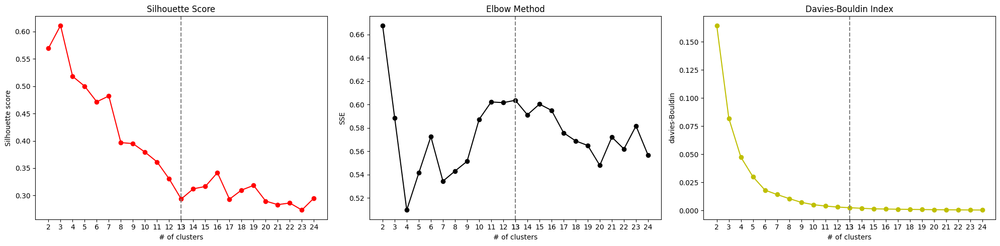

# IU INTERNATIONAL UNIVERSITY OF APPLIED SCIENCES
## DLBDSMLUSL01 – Machine Learning – Unsupervised Learning and Feature Engineering

Welcome to the repository dedicated to the exploration of current trends in science using machine learning and unsupervised learning techniques. In this project, we aim to provide a comprehensive quantitative overview of current topics in science based on a large archive of scientific papers. The goal is to identify homogeneous clusters and present reduced-dimensional views that capture the main traits of the dataset.

## Academic Assignment Overview
### Task 3: Categorizing Trends in Science
As data scientists, our objective is to investigate current topics in science and determine areas where advanced academic cooperation could be beneficial. We have access to a large archive of scientific papers, and the task involves preprocessing the data, exploring descriptive statistics, and applying unsupervised learning techniques to reveal trends.

### Research Objectives:
1. Explore the available data, conduct descriptive statistics, and explorative visualizations.
2. Design a plan for data preprocessing and feature engineering.
3. Apply unsupervised learning techniques to identify homogeneous clusters.
4. Provide reduced-dimensional views capturing the main traits of the dataset.
5. Critically assess decisions made during each step and iterate as necessary.

### Tips:
- Start by exploring the available data with descriptive statistics and explorative visualization.
- Design a plan for data preprocessing and feature engineering.
- Keep the concepts and techniques learned during the course in mind.

### Data:
For this use case, we have been given access to an archive of recently published scientific works. The dataset is available from the following webpage: [arXiv Dataset](https://www.kaggle.com/Cornell-University/arxiv)

# Exploring the dataset
Exploring the topics in the title and abstract.

Abstract Wordcloud

Abstract Wordcloud

# Using PCA and KMeans to find the optimal cluster
Cluster Scores using different metrics

Scatter plot of the top 2 PCA componenets with the found ideal cluster size.

# Articles are grouped by month, and then the cluster label that belongs to this month is identified to discover changes in the themes.
Monthly Clusters Calender

# The word clouds for every cluster are created by finding the most frequent category terms, which are looked up for the respective names.
Cluster Themes in WordCloud

# Reproduction Steps
1. Clone the repo.
2. Download the arxiv-metadata-oai-snapshot.json (3.97 GB) from [arXiv Dataset](https://www.kaggle.com/Cornell-University/arxiv) and place it in the arXiv folder.
3. Create a virtual environment using `python -m venv venv` and activate it using `source venv/bin/activate`.
4. Install the Python modules using `pip install -r requirements.txt`.
5. Run all cells in each notebook (1_eda, 2_preprocessing, 3_tfidf_scores, 4_classification).

# Disclaimer
The notebooks using Dask Distributed to work with the complete dataset require at least 50GB of RAM. This was done with AMD® Ryzen 7 5800h with Radeon graphics × 16, 32GB RAM + 64GB SWAP Memory.

# Disclaimer: 
The following notebooks will use Dask Distributed to work with the complete dataset and require at least 50GB of RAM.
This was done with AMD® Ryzen 7 5800h with Radeon graphics × 16, 32GB RAM + 64GB SWAP Memory.

